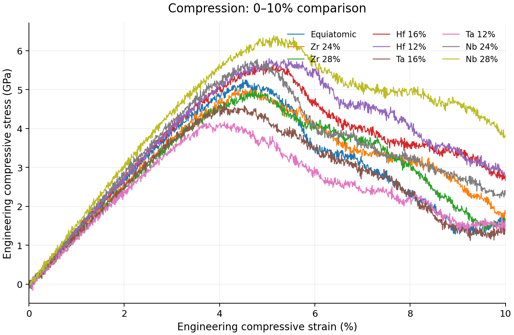

# hea-md-mechanics · Atomistic compression and mechanical descriptor analysis

Composition-dependent compression of a refractory multicomponent alloy (Hf-Nb-Ta-Ti-Zr). Nine nominal compositions, an explicit extraction method, and complete stress–strain records.

[Article](docs/main.pdf) · [Supplement](docs/supplement.pdf) · [Technical Manual](docs/README.md)



## The study

The LAMMPS inputs specify an initially BCC periodic cell with **6,750 sites**, **[001] loading at 10⁹ s⁻¹**, a **300 K temperature target**, and zero target lateral pressure. The composition paths enrich Nb or Zr, or reduce Hf or Ta, while adjusting the remaining four atomic fractions equally.

Within the shared **0–10% engineering compression** interval, Nb 28% has the highest fitted initial stiffness and stress peak among the nine records:

| Nominal composition | Stiffness, 0–2% (GPa) | Operational 0.2% offset stress (GPa) | Peak, 0–10% (GPa) |
|---|---:|---:|---:|
| Equiatomic | 136.60 | 4.33 | 5.25 |
| Nb 28% | 153.97 | 4.92 | 6.39 |
| Ta 12% | 122.34 | 3.75 | 4.17 |

Nb-28% stiffness and initial peak exceed the equiatomic values by **12.72%** and **21.56%**. [Complete numerical table](results/summary.csv).

The analysis applies **60 processing settings to each curve**, producing **540 curve–setting evaluations**. Matched comparisons reveal which trends survive changes in fitting window and offset extraction. Seven records extend to 20% strain and develop larger later maxima; the [complete loading figure](docs/figures/compression-full.png) shows those branches.

## Reproduce the results

Use Python 3.10 or newer, from this directory:

```bash
python -m pip install -e ".[test,plot]"
python -m hea_md verify
python -m pytest -q
```

`verify` checks input hashes, recalculates the campaign, and compares the JSON and all four numerical CSV exports.

To regenerate results and figures:

```bash
python -m hea_md analyze --overwrite
python -m hea_md figures
```

The compiled PDFs (article, supplement) and figures are included in `docs/`. See [technical manual](docs/README.md) and [simulation setup](simulation/README.md).

## Repository

| Path | Content |
|---|---|
| `data/raw/` | Nine source CSVs; 16,009 paired observations |
| `configs/` | Composition mappings, input hashes and analysis parameters |
| `simulation/inputs/` | Nine composition-specific LAMMPS inputs |
| `simulation/potentials/` | MEAM potential parameters (`library.meam`, `HfNbTaTiZr.meam`) |
| `src/hea_md/` | Data reading, finite-window fits, directed offset crossings and bounded maxima |
| `results/` | Full-precision descriptors, fit diagnostics and paired sensitivity ranges |
| `docs/` | Technical manual, compiled PDFs (article, supplement) and figures |
| `tests/` | Analytical cases, transformations, deliberate export corruption and numerical regression |

## Scope and Method Summary

The compression records evaluate directional atomistic response for nine nominal composition paths under a standardized MD protocol (300 K, 10⁹ s⁻¹ [001] engineering strain). Mechanical descriptors include the 0–2% directional stiffness, an operational 0.2% offset stress, and primary/full-record stress peaks. Parameter sweeps across 60 processing settings quantify extraction sensitivity.

[Technical Manual](docs/README.md) · [Citation](CITATION.cff)

**Authors:** José Antonio Martínez Torres and Sergio Javier Mejía-Rosales · Autonomous University of Nuevo León.
